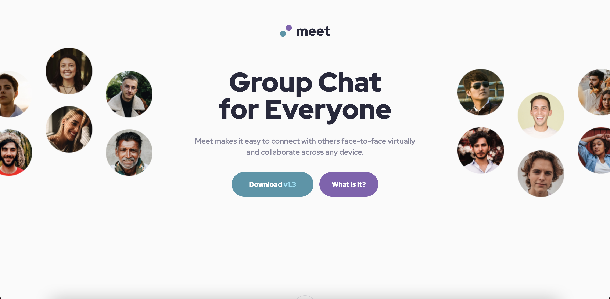

# Frontend Mentor - Meet landing page solution

This is a solution to the [Meet landing page challenge on Frontend Mentor](https://www.frontendmentor.io/challenges/meet-landing-page-rbTDS6OUR). Frontend Mentor challenges help you improve your coding skills by building realistic projects. 

## Table of contents

- [Overview](#overview)
  - [The challenge](#the-challenge)
  - [Screenshot](#screenshot)
  - [Links](#links)
- [My process](#my-process)
  - [Built with](#built-with)
  - [What I learned](#what-i-learned)
  - [Continued development](#continued-development)
- [Author](#author)

## Overview

### The challenge

Users should be able to:

- View the optimal layout depending on their device's screen size
- See hover states for interactive elements

### Screenshot

### Links

- Solution URL: [Frontend Mentor](https://www.frontendmentor.io/solutions/meet-landing-page-JmNLeQT4W)
- Live Site URL: [GitHub Pages](https://brendanmadden.github.io/meet-landing-page/)

## My process

### Built with

- Semantic HTML5 markup
- CSS custom properties
- Flexbox

### What I learned

This challenge tested me on a few different levels. Although the current product isn't pixel perfect, I'm proud that I was able to plan and code this project in about 7 hours, in one day. I continued to learn flexbox and setting up a layout in CSS. I also continued to learn and practice responsive desgin and media queries. 

### Continued development

I have a number of area's I would like to continue to develop and improve in. The most important area's for improvement I would like to focus on are my responsive design, accessibility, and layout capabilities. I need to get better with media queries and ensuring the product works on every device, at every screen size. 

## Author

- GitHub - [Brendan Madden](https://github.com/brendanmadden)
- Frontend Mentor - [@brendanmadden](https://www.frontendmentor.io/profile/brendanmadden)
- Twitter - [@BrendanMadden_](https://www.twitter.com/BrendanMadden_)
